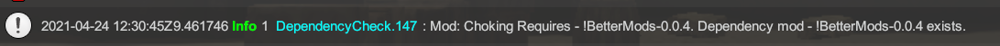

# Welcome to the documentation for **BetterMods**.
Refer to [the documentation here](api/index.html) for BetterMods.
## Quick Start Notes:
1. Download BetterMods from Nexus [here](https://www.nexusmods.com/bladeandsorcery/mods/3668)
2. Extract the `!BetterMods` folder to your Blade and Sorcery mod folder `\Blade & Sorcery\BladeAndSorcery_Data\StreamingAssets\Mods`
3. In your mod project, add a reference to `!BetterMods.dll`
4. Start making your mod!
5. When packaging your mod and putting it on nexus, make sure you add BetterMods as a dependency for your mod


# Example Mod:
1. Wully's Choking mod is available on Nexus [here](https://www.nexusmods.com/bladeandsorcery/mods/3672).
2. You can view the source for it [here](https://github.com/Wully616/baschokingmod)

# Using BetterEvents
BetterEvents is a collection of events which you can listen to, eliminating complex logic from handling BAS events yourself!

Simply import the static class with:
```
using static Wully.Events.BetterEvents;
```
You can then start typing On<...> and intelliSense will show you the available events you can listen to. Such as:
```
OnPlayerDismemberCreatureHead += MyClass_OnPlayerDismemberCreatureHead;
```
Check out the using static Wully.Events.BetterEvents; functions [here](/api/Wully.Events.BetterEvents.html#events)


# Using BetterHelpers
BetterHelpers is a collection of static functions to simplify your code and make it easier to read

Simply import the static functions with:
```
using static Wully.Helpers.BetterHelpers;
```
You can then start using the functions right away. Such as:
```
if ( !IsPlayerUsingTelekinesis(side) && (IsGripPressed() || IsGripAndCastPressed()) ) {
	Debug.Log("Player isnt using TK but is holding some buttons..");
}
```
Check out the BetterHelper functions [here](/api/Wully.Helpers.BetterHelpers.html)

# Using BetterLogger
BetterLogger is a simple wrapper around UnityDebug Logs and UnityIngameDebugConsole which BAS uses.
It dynamically creates new console commands for enabling and disabling logging and setting the log level per class at run time!
The set log level will log that level and everything below it. 
```
Debug > Info > Warn > Error
```
For example setting log level to `Info` will log `Info`, `Warn` and `Error` messages

##Sample class showing BetterLogger:
```
using UnityEngine;
using Wully.Helpers;
using static Wully.Helpers.BetterHelpers;

public class MyClass : MonoBehaviour {

	private static BetterLogger log = BetterLogger.GetLogger(typeof(MyClass));

	void Start() {
		name = "my Mono";
		log.EnableLogging();
		log.SetLoggingLevel(BetterLogger.level.Info);
		log.Info("My Class started!");
	}

	void Update() {
		for ( int i = 0; i < 3; i++ ) {
			log.Debug().Message("Update {0} go brrr", i);
		}
	}

	void OnEnable() {
		log.Error().Message("Something bad happened at : {1} in our object {2}, while at position: {3}", Time.time, gameObject.name, transform.position);
	}
}
```

### Example commands generated for a class


### Example log output


# Using BetterDependencies
BetterDependencies does a couple of things to check if users mods and dependencies are in good condition.
This can help modders fix issues with their mods faster and inform users if they have a missing download.

#### Manifest Validation
1. Checks if a duplicate manifest is found - ie two manifest.json's with the same mod name in them - even in different folders

2. Checks if a mod folder's name does not match the mod name in the manifest.json - highlighting it will probably not work with vortex installs

3. Checks if the manifest.json game version does not match the current game version. I know U9 mods work with U9.2 and such, but its a helpful indicator


#### JSON Configured Dependency Checking

Add a dependencies.json file to your mod folder - beside the manifest.json
Inside it, you list different mods which your mod requires. The mods name should match the manifest.json name for that mod, same with the version

```
[
    {
        "name": "!BetterMods",
        "version": "0.0.4"
    },
    {
        "name": "AnotherMod",
        "version": "1.0.0"
    },
    {
        "name": "YouReallyNeedThisMod",
        "version": "1.0.0"
    }
]
```

BetterDependencies will:
1. Check the manifests of the installed mods vs what is requested in dependencies.json
2. Check if the mod is installed and the correct version.
	
3. Warns if there is a version mismatch.
	
4. Logs an Error if the mod does not appear at all in the mod folder.
	

#### Dll Dependency Checking
For mods which contain a DLL, it will check if any referenced dlls are also loaded 
It will warn if it could not find a required referenced dll - this can produce some false positives as it only checks for dlls in B&S, not system ones.
This can help to diagnose if a user is missing a required mod, without needing to define a dependencies.json file.	
	